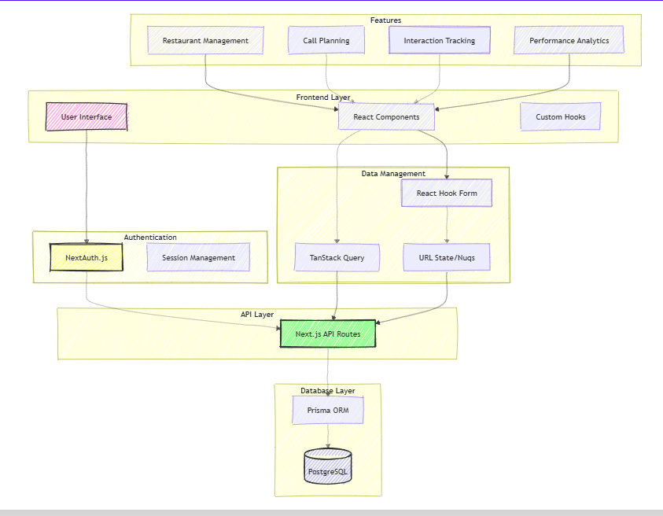

<div align="center"><strong>Key Account Manager (KAM) Lead Management System
 built with Next.js 14,With Shadcn-ui</strong></div>
<div align="center">Built with the Next.js App Router</div>
<br />
<div align="center">
<a href="https://kam-beige.vercel.app/">View Demo</a>
<video controls src="KAM-Demo.mp4" title="Title"></video>
<span> 
</div>


https://github.com/user-attachments/assets/e9ec2fd2-d044-494b-ad27-17b633b2322b


# Overview

The  KAM-Lead Management System is a comprehensive solution built with Next.js 14. It is designed to streamline restaurant management and enhance performance tracking through a variety of powerful features:
- Lead Management & Tracking
- Call Planning System
- Performance Analytics
- Admin Dashboard
This system provides an intuitive dashboard for lead management, call tracking, and sales metrics visualization, ensuring efficient restaurant management and performance tracking.


# Tech Stack
- Framework - [Next.js 14](https://nextjs.org/)
- Language - [TypeScript](https://www.typescriptlang.org)
- Database ORM - [Prisma](https://www.prisma.io)
- Auth - [NextAuth.js](https://next-auth.js.org)
- UI Components - [Shadcn/ui](https://ui.shadcn.com)
- Styling - [Tailwind CSS](https://tailwindcss.com)
- Forms - [React Hook Form](https://react-hook-form.com)
- Data Tables - [TanStack Table](https://tanstack.com/table)
- Charts - [Chart.js](https://www.chartjs.org)
- State Management - [TanStack Query](https://tanstack.com/query)
- Database Client - [Prisma Client](https://www.prisma.io/client)
- Schema Validations - [Zod](https://zod.dev)
- Search params state manager - [Nuqs](https://nuqs.47ng.com/)
- Auth - [Auth.js](https://authjs.dev/)
- Command+k interface - [kbar](https://kbar.vercel.app/)
- Linting - [ESLint](https://eslint.org)
- Formatting - [Prettier](https://prettier.io)


### Key Features:
- Lead Management Dashboard
- Call Planning & Tracking
- Restaurant Performance Analytics
- Sales Metrics Visualization
- Admin Role Management
- Responsive Design

********************************************************************************
# System Requirements

- Node.js 14 
- pnpm v8 
- Windows 10/11, macOS, or Linux
- Visual Studio Code (recommended)

********************************************************************************

# Installation Instructions
1.Setup Project
  ## Clone repository
  ```bash
  -git clone https://github.com/preityzz/KAM
  ```

  ## Change Directory:
  
    cd assignment
   

  ## Install dependencies
   
    pnpm install
 

3.Environment Configuration
  ## Create .env file
  copy .env.example .env

  ## Update .env with your values
  -DATABASE_URL="postgresql://..."
  -NEXTAUTH_SECRET="your-secret"
  -NEXTAUTH_URL="http://localhost:3000"

4.Database Setup
  ## Generate Prisma client
  ```bash
 pnpm prisma generate
 ```

  ## Push database schema
  ```bash
  pnpm prisma db push
  ```

  ## Seed database (optional)
  ```bash
  pnpm prisma db seed
  ```

********************************************************************************

# Running Instructions
   ## Project Run
   ```bash
    pnpm run dev
  ```

   ## Manage Database Content
   ```bash
    npx prisma studio
   ```
You should now be able to access the application at http://localhost:3000.

********************************************************************************

# Test execution guide

## Environment Setup
* Install dependencies
  -pnpm install

## Setup test database
- pnpm prisma generate
- pnpm prisma db push

## Running Tests
Run all tests
 - pnpm test

-Run specific test suites
  - pnpm test auth        # Run auth tests
  - pnpm test restaurant  # Run restaurant tests
  - pnpm test callplans   # Run call plan tests

* Test Cases
  - Authentication Tests
  - User registration
  - Login with valid credentials
  - Login with invalid credentials
  - Password reset flow

## Troubleshooting
- 1.Network Issues
- 2.Check the internet connection if API tests fail due to timeouts or network errors.
- 3.Database Errors.
  - Ensure the test database is running.
  - Verify the database configuration (e.g., host, port, credentials) in the .env file.
- 6.Dependency Issues
  - Reinstall dependencies:
  - npm install
- 7.Check for missing or outdated packages.

********************************************************************************

# API documentation

 ## Authentication Endpoints 
  1.  POST: /api/auth/login
 * Description: Authenticate user and get session token
 * Request Body:{
  "email": "string",
  "password": "string"
  }
 * Response: JWT token and user details

 ## Restaurant Endpoints
 1.   GET:/api/restaurants
  * Description: Get all restaurants for a user
  * Query Parameters:
        userId: string
  * Response: Array of restaurant objects

 2.  POST:api/restaurants
  * Description: Create new restaurant
  * Request Body:{
        "name": "string",
        "address": "string",
        "phone": "string",
        "status": "active|pending|inactive",
        "userId": "number"
       }
  
  3.  PATCH:/api/restaurants/{id}
  * Description: Update restaurant details
  * Parameters:
        id: Restaurant ID
  * Request Body: Restaurant update fields

  4. DELETE /api/restaurants/{id}
  *  Description: Delete restaurant
  * Parameters:
        id: Restaurant ID
  
  ## Call Plans Endpoints
  1. GET:/api/callPlans
  * Description: Get all call plans
  * Query Parameters:
        userId: string
  * Response: Array of call plan objects

  2. POST /api/callPlans
  * Description: Create new call plan
  * Request Body: {
          "restaurantId": "string",
          "nextCallDate": "string",
          "frequency": "number",
          "status": "pending|completed|missed"
        }

 ## Interactions Endpoints
 1. GET:/api/interactions
 * Description: Get all interactions
 * Query Parameters:
        restaurantId: string
 * Response: Array of interaction objects

 2.POST /api/interactions
 * Description: Create new interaction
 * Request Body:{
          "restaurantId": "string",
          "type": "string",
          "notes": "string",
          "date": "string"
        }
  
  ## Response Formats
        {
          "message": "string",
          "data": {}
        }
  ## Error Response
        {
          "error": "string",
          "message": "string"
        }
  ## Status Codes
        200: Success
        201: Created
        400: Bad Request
        401: Unauthorized
        403: Forbidden
        404: Not Found
        500: Server Error

********************************************************************************

# Sample usage examples
 - Email:admin@example.com
 - Password:  1234                     


- {
  - "id": 3,
  - "email": "admin@example.com",
  - "password": "$2b$10$hashedPasswordHere",
  - "role": "ADMIN",
  - "createdAt": "2023-09-28T00:00:00.000Z",
  - "updatedAt": "2023-09-28T00:00:00.000Z",
  - "isVerified": true
- }


 # Input 
  ## For Restaurant 
  {
    "name": " Restaurant XYZ"
    "phone": "324-543-6543"
    "status": "active",
    "address": "Dandal-32",
     "userId": 3
} 
 
 ## For POCs
  {
     "name": "David Lee",
    "role": "Dishwasher",
    "email": "david@kitchenette.com",
    "phone": "555-0131",
    "restaurantId": 24
  }

## For CallPlans
{
    "restaurantId":23,
  "frequency": 8,
  "lastCallDate": "2024-12-27",
  "nextCallDate": "2024-12-27"

}

## For Interaction

  {
  "interactionType": "Order",
  "details": "Order is Scheduled",
  "interactionDate": "2024-12-29T15:30:00Z",
  "restaurantId": 26,
  "userId": 3

}

## For Orders
{
  "restaurantId": 25,
  "orderDate": "2024-12-25T15:30:00Z",
  "orderValue": 143.43,
  "orderStatus": "Completed",
  "performanceId": 1
}
  


# Pages

| Pages | Specifications |
| :--- | :--- |
| [Login](https://kam-7jcoe1jsm-preetitrip14-gmailcoms-projects.vercel.app/) | Authentication with **NextAuth.js**, email/password login for admin access |
| [Dashboard](https://kam-7jcoe1jsm-preetitrip14-gmailcoms-projects.vercel.app/dashboard/overview) | Main dashboard with performance metrics, charts, and daily calls overview |
| [Restaurants](https://kam-7jcoe1jsm-preetitrip14-gmailcoms-projects.vercel.app/dashboard/restaurantLeads) | Restaurant lead management with TanStack table |
| [Restaurants/new](https://kam-7jcoe1jsm-preetitrip14-gmailcoms-projects.vercel.app/dashboard/restaurantLeads/new) | New restaurant lead form using shadcn form with react-hook-form + zod validation |
| [Call Plans](https://kam-7jcoe1jsm-preetitrip14-gmailcoms-projects.vercel.app/dashboard/callPlans) | Call scheduling system with calendar view and Frequency|
| [Interactions](https://kam-7jcoe1jsm-preetitrip14-gmailcoms-projects.vercel.app/dashboard/interactions) | Type of Interactions between restaurant selection and scheduling|
| [Orders](https://kam-7jcoe1jsm-preetitrip14-gmailcoms-projects.vercel.app/dashboard/orders) | Detailed performance metrics, conversion rates, and sales analytics |
| [Not Found](https://kam-7jcoe1jsm-preetitrip14-gmailcoms-projects.vercel.app/dashboard/notfound) | Custom 404 error page with navigation assistance |                                                                                                                               |

## Design Overview 

 


